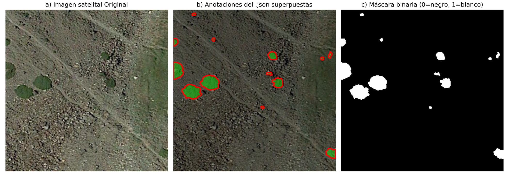
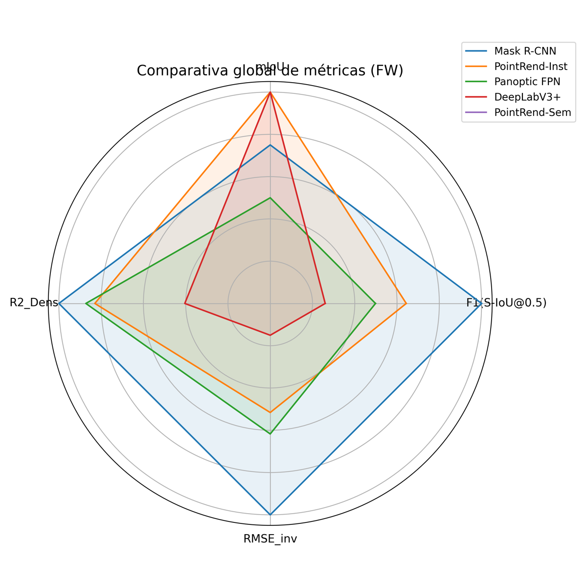
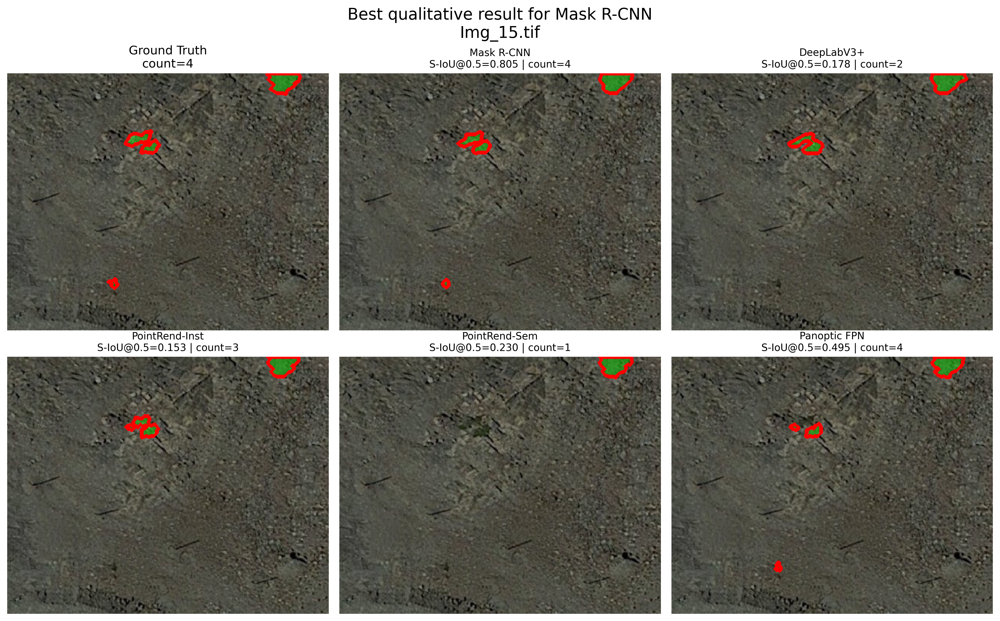
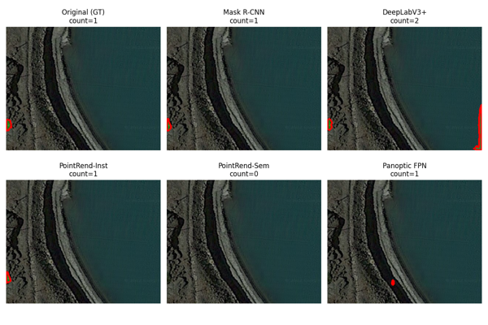

# Juniperus Segmentation and CNN Bias Analysis

Deep learning-based segmentation of polymorphic *Juniperus* shrubs in high-mountain satellite imagery using semantic, instance and panoptic segmentation architectures.

---

## Overview

Monitoring shrub species such as *Juniperus communis* and *Juniperus sabina* is essential for understanding ecosystem dynamics, vegetation distribution and landscape changes associated with climate change in high-mountain environments.

This project explores the use of deep learning for automatic shrub segmentation in high-resolution aerial and satellite imagery. Different computer vision paradigms were evaluated, including semantic, instance and panoptic segmentation.

A major focus of the study is the analysis of **CNN texture bias** and its influence on the detection and delineation of polymorphic shrub structures under varying environmental conditions.

The repository contains training pipelines, evaluation workflows, qualitative comparisons and metric analyses for several state-of-the-art architectures.

---

## Models Evaluated

The following architectures were trained and evaluated throughout the project:

- **Mask R-CNN**
- **DeepLabV3+**
- **PanopticFPN**
- **PointRend (Instance Segmentation)**
- **PointRend (Semantic Segmentation)**

---

## Objectives

The main objective of this project is to evaluate the robustness and generalization capability of deep learning segmentation models for individual *Juniperus* shrub detection.

Specific goals include:

- Comparing semantic, instance and panoptic segmentation approaches.
- Studying CNN texture bias in polymorphic vegetation.
- Evaluating cross-domain generalization performance.
- Measuring ecological variables such as shrub density and crown coverage.
- Analyzing segmentation errors related to shrub morphology and terrain complexity.
- Investigating how architectural differences affect robustness and boundary delineation.

---

## Technologies

- Python
- PyTorch
- Detectron2
- OpenCV
- NumPy
- Matplotlib
- Jupyter Notebook
- Google Colab

---

## Datasets

Two complementary datasets were used during experimentation:

| Dataset | Description |
|---|---|
| **PI (Photo Interpretation Data)** | Training and internal validation dataset |
| **FW (Field Work Data)** | External evaluation dataset used for generalization analysis |

---

## Dataset and Annotations

Example of satellite imagery, manual polygon annotations and binary masks used during training.



---

## Quantitative Model Comparison

Radar chart comparing the performance of all evaluated architectures across both semantic and instance segmentation metrics.

The visualization highlights the trade-offs between segmentation quality, robustness and generalization capacity for each model.



---

## Qualitative Model Comparison

Qualitative comparison between different segmentation architectures evaluated in the project.

Mask R-CNN achieved the most balanced and consistent performance for individual shrub detection across multiple scenarios.



---

## Challenging Scenarios and Generalization

Example of a challenging scene where the evaluated architectures exhibit different behaviors under difficult terrain conditions, irregular shrub boundaries and complex textures.



---

## Evaluation Metrics

The project combines both semantic and instance-level evaluation metrics, including:

### Semantic Segmentation Metrics
- F1 Score
- Precision
- Recall

### Instance Segmentation Metrics
- IoU@0.5 and IoU@0.75
- S-IoU@0.5 and S-IoU@0.75
- Detection Accuracy
- Shrub Density Error
- Crown Coverage Error

---

## Repository Structure

```text
notebooks/    -> training and evaluation notebooks
images/       -> figures, visual results and comparison plots
report/       -> master's thesis report
```

---

## Main Findings
- Mask R-CNN provided the most robust overall performance across datasets.
- Semantic segmentation models achieved smoother global masks but struggled with individual shrub separation.
- Instance-based approaches improved delineation of isolated shrubs.
- CNN texture bias significantly affected generalization under domain shift conditions.
- Performance degradation was especially noticeable in heterogeneous terrain and boundary-heavy regions.

---

## Report

The complete master's thesis report is included in the repository and contains:

- Methodology
- Experimental setup
- Quantitative evaluation
- Error analysis
- Generalization study
- Ecological interpretation of results

---

## Author

Ana Fuentes Rodríguez. 
BSc in Physics | MSc in Data Science and Computer Engineering
